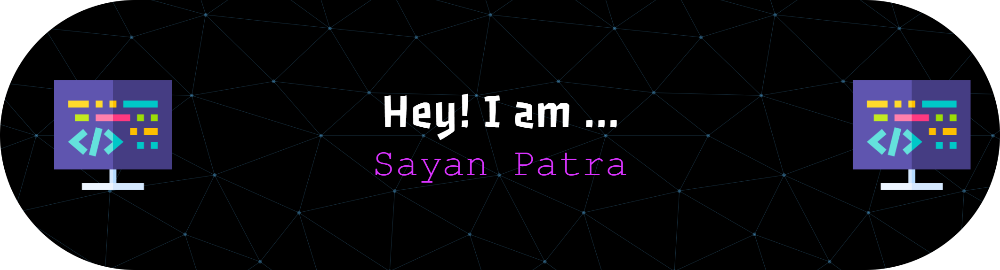

<!--header -->

<!-- middle -->
# 💫 About Me:
I am currently diving into computational biology. Currently, I am learning DSA. I am working to bridge the gap between biology and computer science by leveraging Artificial Intelligence and Machine Learning. I enjoy listening to music, coding, and reading books.

## 🌐 Socials:
  

# 💻 Tech Stack:
                 
# 📊 GitHub Stats:
 
 

## 🏆 GitHub Trophies

### 🔝 Top Contributed Repo

---

